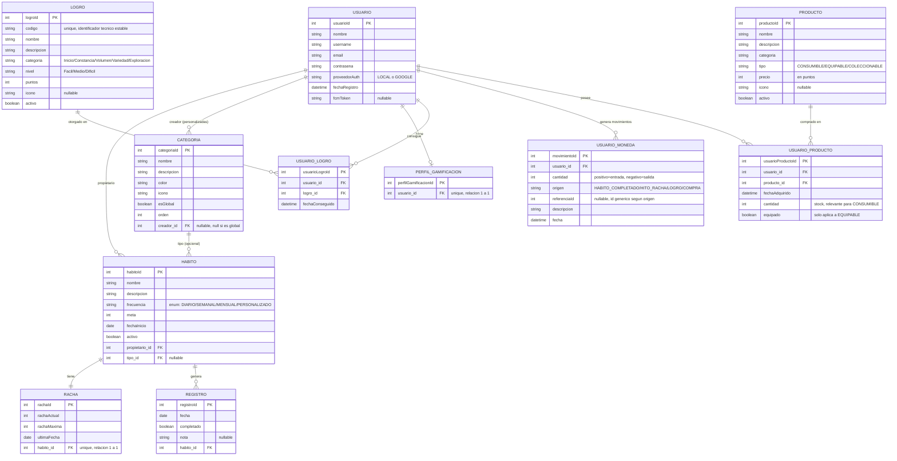

# HábitosApp — Modelo Entidad-Relación

*Última actualización: julio 2026*

> Este diagrama refleja el modelo de datos actual. La entidad `Habito` incluye el campo `frecuencia`, que en la Fase Crítica de rediseño de rachas perderá los valores `MENSUAL` y `PERSONALIZADO` (quedarán solo `DIARIO` y `SEMANAL` en V1) — el diagrama no refleja aún ese cambio, ya que el código todavía no se ha modificado.

## Notas sobre las relaciones

- **Usuario → Categoria (creador):** solo las categorías personalizadas por un usuario tienen `creador_id` relleno. Las 10 categorías globales (sembradas por `DataInitializer`) tienen `creador_id = null`.
- **Habito → Racha:** relación 1 a 1 real — cada hábito tiene exactamente una fila de racha asociada, creada automáticamente al crear el hábito.
- **UsuarioMoneda → referenciaId:** es un campo genérico sin FK estricta a nivel de base de datos. Según el valor de `origen`, apunta a un `habito_id`, `logro_id` o `producto_id` distinto. Decisión de diseño para evitar tres columnas FK casi siempre en null.
- **PerfilGamificacion:** hoy casi vacía (solo la relación con Usuario), preparada para futuros campos de V2 (niveles, XP) sin necesitar una migración.
