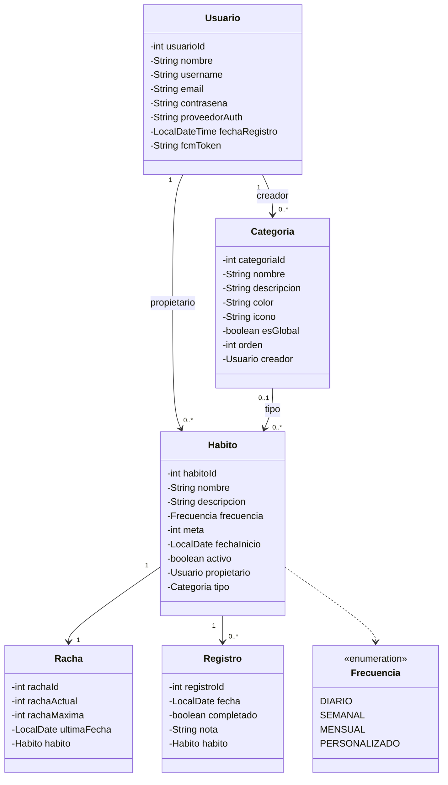
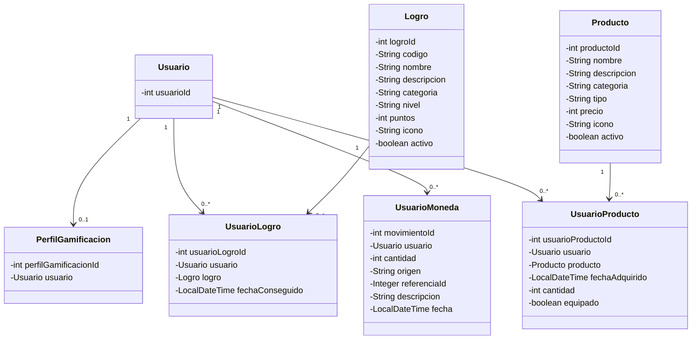
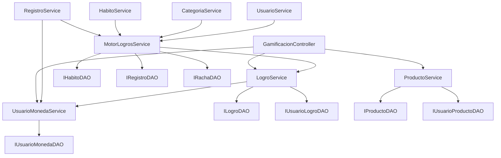

# HábitosApp — Diagramas UML de Clases

*Última actualización: julio 2026*

Se presentan dos diagramas separados por dominio, para mantener la legibilidad: **Núcleo de hábitos** y **Gamificación**. `Usuario` aparece en ambos como punto de conexión entre dominios.

---

## Dominio: Núcleo de Hábitos

> ⚠️ **Pendiente (Fase Crítica):** el enum `Frecuencia` perderá `MENSUAL` y `PERSONALIZADO` en V1 — quedarán solo `DIARIO` y `SEMANAL`. Este diagrama refleja el estado actual del código, aún sin modificar.

---

## Dominio: Gamificación

---

## Arquitectura de capas (backend)

No es UML de clases estricto, pero ayuda a visualizar cómo se conectan las piezas de la Fase 9:

**Lectura del diagrama:** `MotorLogrosService` es el punto central de evaluación — se llama desde los 4 servicios de negocio (`RegistroService`, `HabitoService`, `CategoriaService`, `UsuarioService`) cada vez que ocurre una acción relevante, y a su vez usa `LogroService` para otorgar logros, que internamente ya dispara el registro de puntos correspondiente en `UsuarioMonedaService`.
