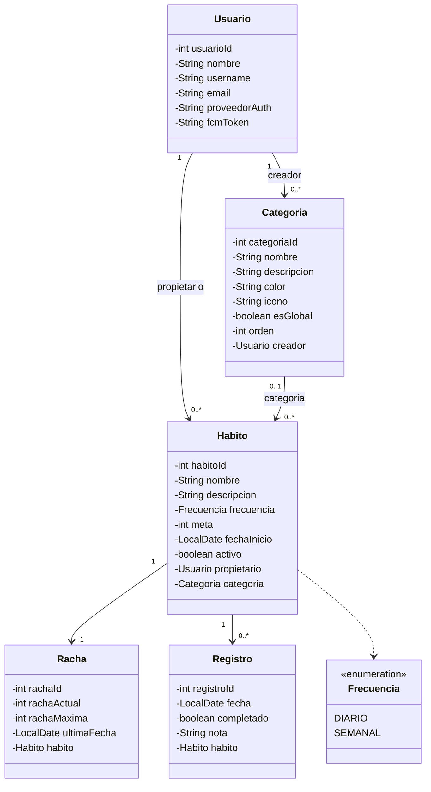
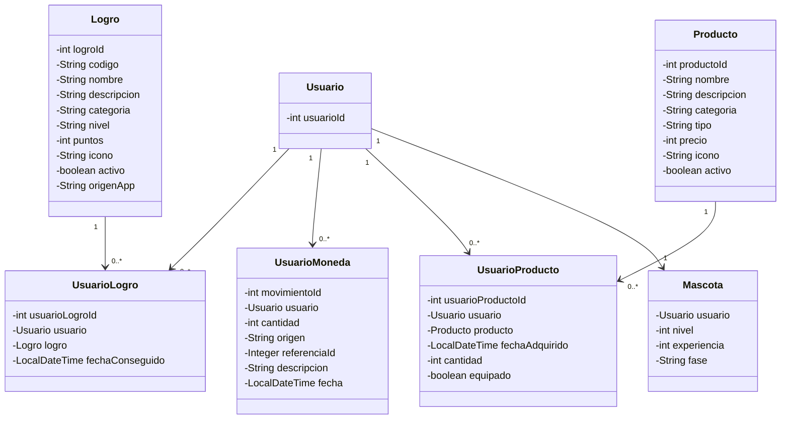
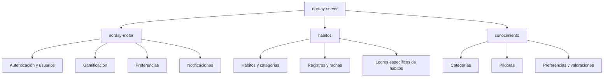
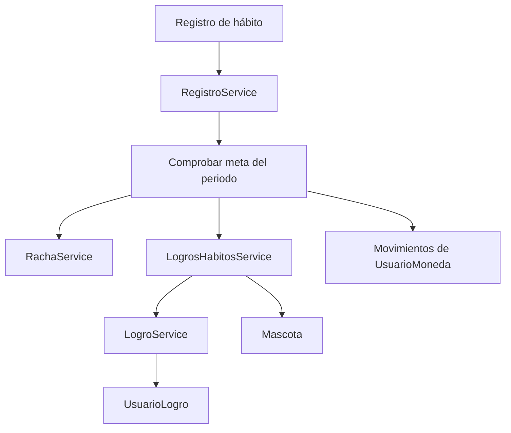
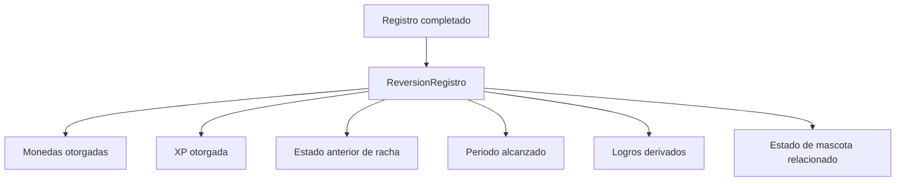

# Norday Habits — Diagramas UML de Clases

*Última actualización: septiembre 2026*

Los diagramas se separan por responsabilidad para mantener la legibilidad: **Núcleo de hábitos**, **Gamificación** y **Arquitectura de servicios**.

> Los diagramas representan el modelo funcional actualmente documentado a partir del backend. No incluyen estructuras futuras ni clases retiradas.

---

## Dominio: Núcleo de Hábitos

```mermaid
classDiagram
    class Usuario {
        -int usuarioId
        -String nombre
        -String username
        -String email
        -String proveedorAuth
        -String fcmToken
    }

    class Categoria {
        -int categoriaId
        -String nombre
        -String descripcion
        -String color
        -String icono
        -boolean esGlobal
        -int orden
        -Usuario creador
    }

    class Habito {
        -int habitoId
        -String nombre
        -String descripcion
        -Frecuencia frecuencia
        -int meta
        -LocalDate fechaInicio
        -boolean activo
        -Usuario propietario
        -Categoria categoria
    }

    class Racha {
        -int rachaId
        -int rachaActual
        -int rachaMaxima
        -LocalDate ultimaFecha
        -Habito habito
    }

    class Registro {
        -int registroId
        -LocalDate fecha
        -boolean completado
        -String nota
        -Habito habito
    }

    class Frecuencia {
        <<enumeration>>
        DIARIO
        SEMANAL
    }

    Usuario "1" --> "0..*" Habito : propietario
    Usuario "1" --> "0..*" Categoria : creador
    Categoria "0..1" --> "0..*" Habito : categoria
    Habito "1" --> "1" Racha
    Habito "1" --> "0..*" Registro
    Habito ..> Frecuencia
```

La frecuencia representada aquí se limita a los valores actualmente documentados para la lógica de rachas: `DIARIO` y `SEMANAL`.

La `meta` del hábito determina cuándo se considera cumplido el periodo correspondiente.

---

## Dominio: Gamificación

```mermaid
classDiagram
    class Usuario {
        -int usuarioId
    }

    class Logro {
        -int logroId
        -String codigo
        -String nombre
        -String descripcion
        -String categoria
        -String nivel
        -int puntos
        -String icono
        -boolean activo
        -String origenApp
    }

    class UsuarioLogro {
        -int usuarioLogroId
        -Usuario usuario
        -Logro logro
        -LocalDateTime fechaConseguido
    }

    class UsuarioMoneda {
        -int movimientoId
        -Usuario usuario
        -int cantidad
        -String origen
        -Integer referenciaId
        -String descripcion
        -LocalDateTime fecha
    }

    class Producto {
        -int productoId
        -String nombre
        -String descripcion
        -String categoria
        -String tipo
        -int precio
        -String icono
        -boolean activo
    }

    class UsuarioProducto {
        -int usuarioProductoId
        -Usuario usuario
        -Producto producto
        -LocalDateTime fechaAdquirido
        -int cantidad
        -boolean equipado
    }

    class Mascota {
        -Usuario usuario
        -int nivel
        -int experiencia
        -String fase
    }

    Usuario "1" --> "0..*" UsuarioLogro
    Logro "1" --> "0..*" UsuarioLogro
    Usuario "1" --> "0..*" UsuarioMoneda
    Usuario "1" --> "0..*" UsuarioProducto
    Producto "1" --> "0..*" UsuarioProducto
    Usuario "1" --> "1" Mascota
```

Los logros se dividen entre el motor común y los logros específicos de la aplicación de hábitos. Los específicos de hábitos utilizan `origenApp = "habitos"`.

El modelo no incluye `PerfilGamificacion`: esta estructura fue retirada y sus responsabilidades quedaron cubiertas por las entidades de moneda, productos, logros y mascota.

La mascota forma parte de la gamificación compartida y mantiene información relacionada con evolución, experiencia y nivel.

---

## Arquitectura de módulos del backend

```mermaid
flowchart TD
    Server[norday-server] --> Motor[norday-motor]
    Server --> Habitos[habitos]
    Server --> Conocimiento[conocimiento]

    Motor --> Auth[Autenticación y usuarios]
    Motor --> Gamificacion[Gamificación]
    Motor --> Preferencias[Preferencias]
    Motor --> Notificaciones[Notificaciones]

    Habitos --> HabitosCore[Hábitos y categorías]
    Habitos --> Registros[Registros y rachas]
    Habitos --> LogrosHabitos[Logros específicos de hábitos]

    Conocimiento --> CategoriasConocimiento[Categorías]
    Conocimiento --> Pildoras[Píldoras]
    Conocimiento --> PreferenciasConocimiento[Preferencias y valoraciones]
```

Los módulos mantienen responsabilidades separadas. La gamificación común pertenece al motor, mientras que los servicios de hábitos evalúan los eventos específicos del dominio y utilizan los servicios genéricos correspondientes.

---

## Flujo de gamificación de un registro

```mermaid
flowchart TD
    Registro[Registro de hábito] --> RegistroService
    RegistroService --> Cumplimiento[Comprobar meta del periodo]
    Cumplimiento --> Racha[RachaService]
    Cumplimiento --> Logros[LogrosHabitosService]
    Cumplimiento --> Moneda[Movimientos de UsuarioMoneda]
    Logros --> LogroService[LogroService]
    LogroService --> UsuarioLogro[UsuarioLogro]
    Logros --> Mascota[Mascota]
```

`LogrosHabitosService` se ocupa de determinar los logros propios del dominio de hábitos. La concesión genérica de logros corresponde a `LogroService`.

Los movimientos de moneda forman parte del ledger de gamificación y no dependen de un saldo almacenado como única fuente de verdad.

---

## Reversión de un registro

```mermaid
flowchart TD
    Registro[Registro completado] --> Reversion[ReversionRegistro]
    Reversion --> Monedas[Monedas otorgadas]
    Reversion --> XP[XP otorgada]
    Reversion --> Racha[Estado anterior de racha]
    Reversion --> Periodo[Periodo alcanzado]
    Reversion --> Logros[Logros derivados]
    Reversion --> Mascota[Estado de mascota relacionado]
```

La reversión conserva el estado necesario para deshacer los efectos asociados al completado cuando la operación está disponible.

---

## Notas

- `RachaService` aplica una estrategia de **rotura perezosa**: la racha se normaliza cuando se consulta o utiliza y no mediante un proceso que resetee todas las rachas a una hora fija.
- `NotificadorRachaEnPeligro` se ocupa de las notificaciones de racha en riesgo; no es responsable de romper ni modificar la racha.
- El modelo de gamificación es compartido por el ecosistema, mientras que los eventos que generan logros de hábitos pertenecen al módulo `habitos`.
- No se representan aquí clases retiradas ni estructuras marcadas únicamente como futuras.
